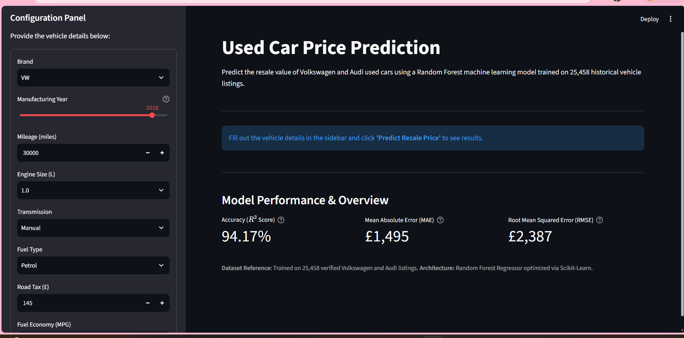
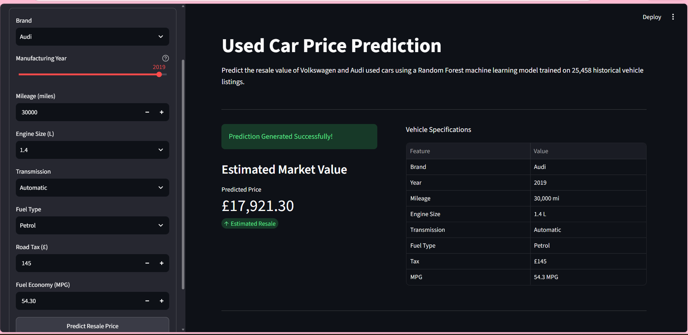
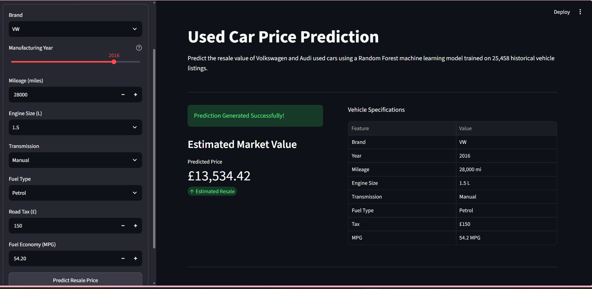
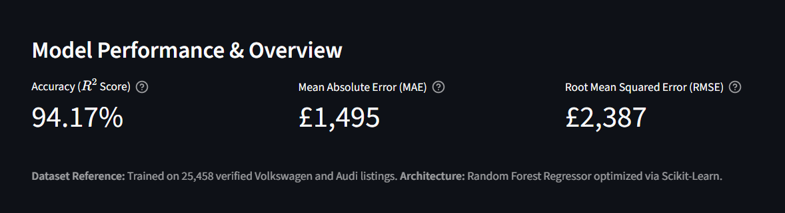

# Used Car Price Prediction


A Machine Learning web application that predicts the resale price of Volkswagen and Audi used cars using a Random Forest Regressor.

---

## Project Overview

This project estimates the market value of used cars based on their specifications such as:

- Brand
- Manufacturing Year
- Mileage
- Engine Size
- Transmission
- Fuel Type
- Road Tax
- Miles Per Gallon (MPG)

The application is built with **Python**, **Scikit-learn**, and **Streamlit**.

---
## Key Highlights

- Predicts resale prices for Volkswagen and Audi vehicles
- Trained on over 25,000 used car listings
- Achieved an R² score of 94.17%
- Interactive web application built with Streamlit
---
## Dataset

The dataset consists of **25,458** used car listings from:

- Volkswagen
- Audi

The data was cleaned, preprocessed, and combined before training the machine learning models.

---

## Machine Learning Models

Two regression models were trained:

- Linear Regression
- Random Forest Regressor

Random Forest produced the best performance and was selected for deployment.

---

## Model Performance

| Metric   | Value  |
| -------- | ------ |
| R² Score | 94.17% |
| MAE      | £1,495 |
| RMSE     | £2,387 |

---

## Project Structure

```
Used_Car_Price_Prediction/

│
├── app.py
├── requirements.txt
├── README.md
├── LICENSE
│
├── data/
│ ├── audi.csv
│ └── vw.csv
│
├── models/
│   └── (Generated after training)
│
├── outputs/
│
└── src/
    ├── __init__.py
    ├── config.py
    ├── preprocess.py
    ├── feature_engineering.py
    ├── train.py
    ├── predict.py
    └── utils.py
```

---

## Features
- Data cleaning and preprocessing
- Feature engineering
- Random Forest regression model
- Linear Regression baseline model
- Interactive Streamlit web application
- Real-time used car price prediction
- Modular project architecture
---

## Technologies Used


**Programming Language**
- Python

**Libraries**
- Pandas
- NumPy
- Scikit-learn
- Joblib

**Framework**
- Streamlit

---


## Installation

Clone the repository

```bash
git clone https://github.com/SanyaR2908/Used_Car_Price_Prediction.git
```

Move into the project

```bash
cd Used_Car_Price_Prediction
```

Install dependencies

```bash
pip install -r requirements.txt
```

Train the models

```bash
python src/train.py
```

Run the Streamlit application

```bash
streamlit run app.py
```

---
## Live Demo

Streamlit app link: (https://vehicle-price-estimator.streamlit.app)
## Application Preview

### Home Screen



---

### Prediction Result



---

### Prediction Result



---

### Model Performance


---
## Future Improvements

- Support additional car brands
- Hyperparameter tuning
- Model explainability using SHAP
- Cloud deployment
- Improved UI/UX

---

## Author

**Sanya Ray**

B.Tech in Electronics and Communication Engineering

Interests:
- Machine Learning
- Data Science
- Python Development
- Artificial Intelligence

GitHub Profile: https://github.com/SanyaR2908
## License

This project is licensed under the MIT License.